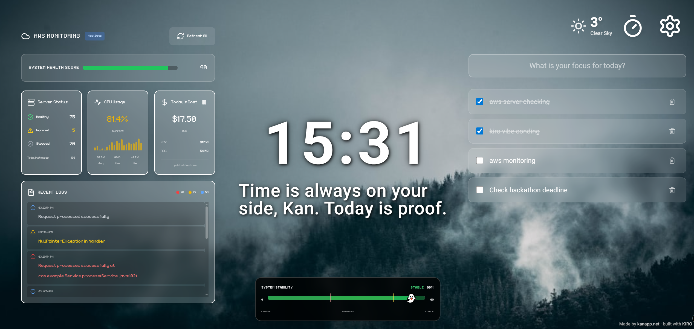
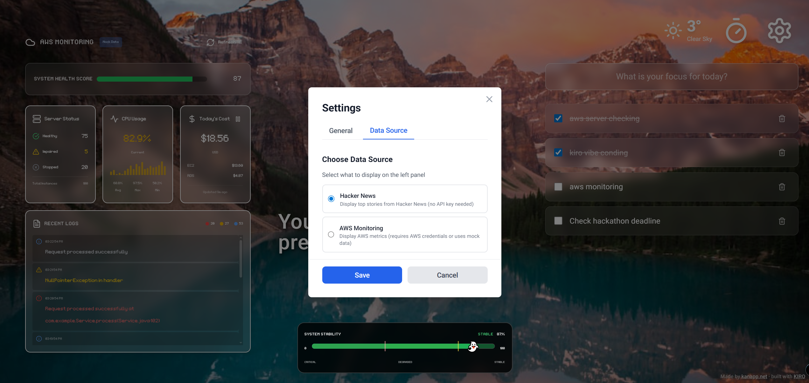
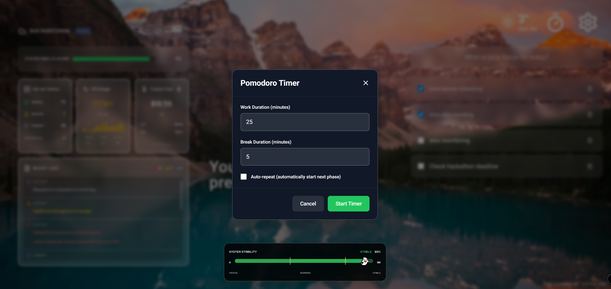
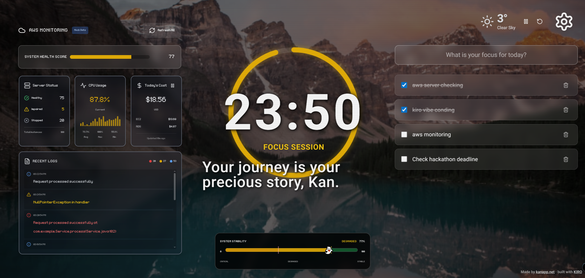
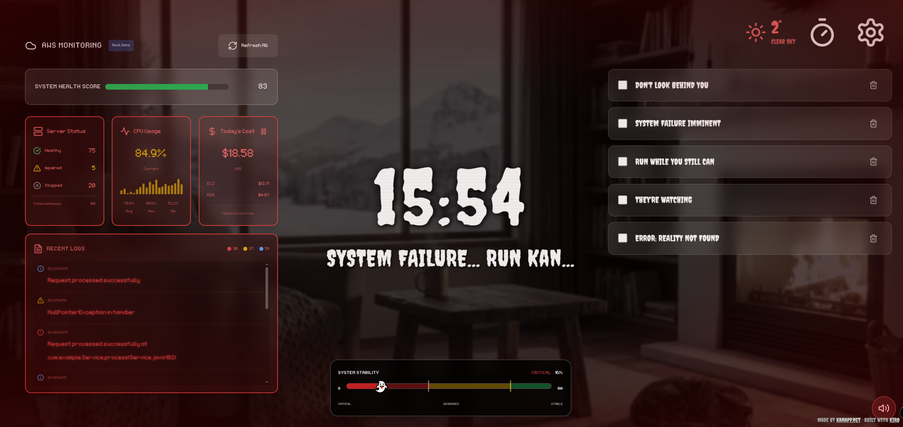

# DevOps Nightmare Dashboard

A browser-based productivity dashboard that transforms from a peaceful, Momentum-style interface into a horror-themed nightmare based on simulated server health status.

All information is stored in local storage and is not saved separately in a database. AWS integration is currently configured with dummy data, and some code modifications may be required when connecting with actual API keys.

## 📸 Screenshots

### Peaceful Mode (Hacker News RSS)


### Peaceful Mode (AWS Monitoring)


### Settings


### Pomodoro Settings


### Pomodoro Running


### Nightmare Mode


## Tech Stack

- **Framework**: React 18 with TypeScript
- **Build Tool**: Vite
- **Styling**: Tailwind CSS with custom horror theme extensions
- **Icons**: Lucide React
- **Testing**: Vitest + React Testing Library + fast-check (property-based testing)

## Project Structure

```
src/
├── components/     # React components
├── contexts/       # React contexts (Theme Manager)
├── services/       # Business logic and API services
├── types/          # TypeScript type definitions
├── assets/         # Static assets (images, sounds)
└── test/           # Test utilities and setup
```

## Getting Started

### Install Dependencies

```bash
npm install
```

### Development

```bash
npm run dev
```

### Build

```bash
npm run build
```

### Test

```bash
npm test          # Run tests once
npm run test:watch # Run tests in watch mode
```

### Lint

```bash
npm run lint
```

## Features

### Core Productivity Features
- **Personalized Greeting**: Time-based greetings with your name
- **Digital Clock**: Real-time clock with optional Pomodoro timer
- **Todo List**: Persistent task management with LocalStorage
- **Weather Widget**: Current weather based on your location
- **Beautiful Backgrounds**: Unsplash API integration with local fallbacks
- **Pomodoro Timer**: Integrated productivity timer with work/break cycles

### Data Source Options

Choose between two data sources for the left panel:

#### 1. Hacker News (Default)
- Displays top stories from Hacker News
- No configuration needed
- Updates every 5 minutes
- Switch between Top, New, and Best stories
- Health score based on story activity

#### 2. AWS Monitoring
- Displays AWS infrastructure metrics
- **Mock Data Mode** (default): No AWS credentials needed
- **Real AWS Mode**: Connect to your AWS account
- Monitors: EC2 instances, CloudWatch metrics, logs, and costs
- Health score based on server status and metrics

See [AWS_SETUP.md](./AWS_SETUP.md) for detailed AWS configuration instructions.

### Horror Theme Modes

The dashboard transforms based on a "health score" (0-100):

- **Peaceful Mode** (Health 80-100%): Clean, calming interface
- **Glitch Mode** (Health 40-79%): Visual distortions and glitch effects
- **Nightmare Mode** (Health 0-39%): Full horror experience with scary visuals and sounds

The health score is calculated from:
- **AWS Mode**: Server status, error logs, and CPU metrics
- **Hacker News Mode**: Story scores and comment activity

### Audio Features

The AudioManager component provides immersive horror sound effects in Nightmare Mode:

- **Automatic Playback**: Sounds play automatically when entering Nightmare Mode
- **Mute/Unmute Toggle**: User control over audio playback
- **Autoplay Handling**: Graceful handling of browser autoplay restrictions with manual play option
- **Graceful Fallback**: Works seamlessly even if audio files are missing
- **Audio Files**: Place MP3 files in `public/audio/` directory (see `public/audio/README.md` for details)

## Theme Configuration

The Tailwind configuration includes custom extensions for horror modes:

- Custom fonts: Roboto (peaceful), Creepster & Nosifer (horror)
- Custom animations: glitch, flicker, pulse-red
- Custom colors: nightmare-red, glitch-gray
- Horror-specific utilities: vignette effects, scanlines

## Testing Strategy

- **Unit Tests**: Component behavior and business logic
- **Property-Based Tests**: Universal properties using fast-check (100+ iterations)
- **Integration Tests**: User flows and component interactions

## License

MIT
